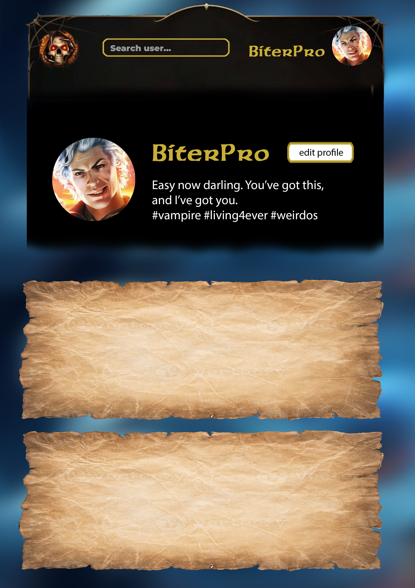
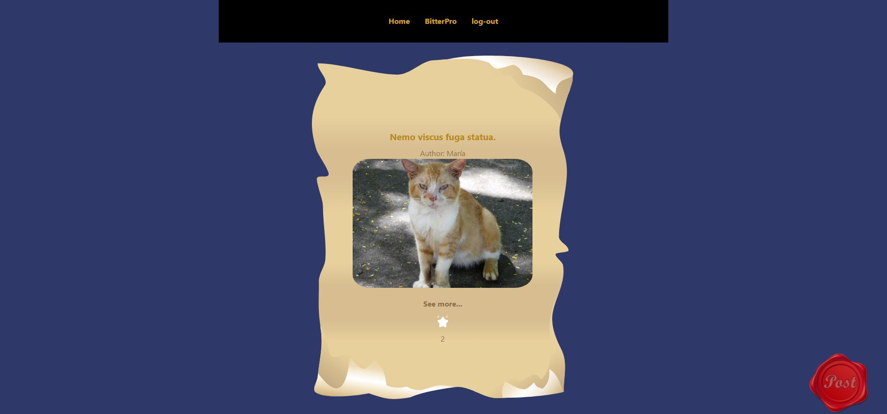
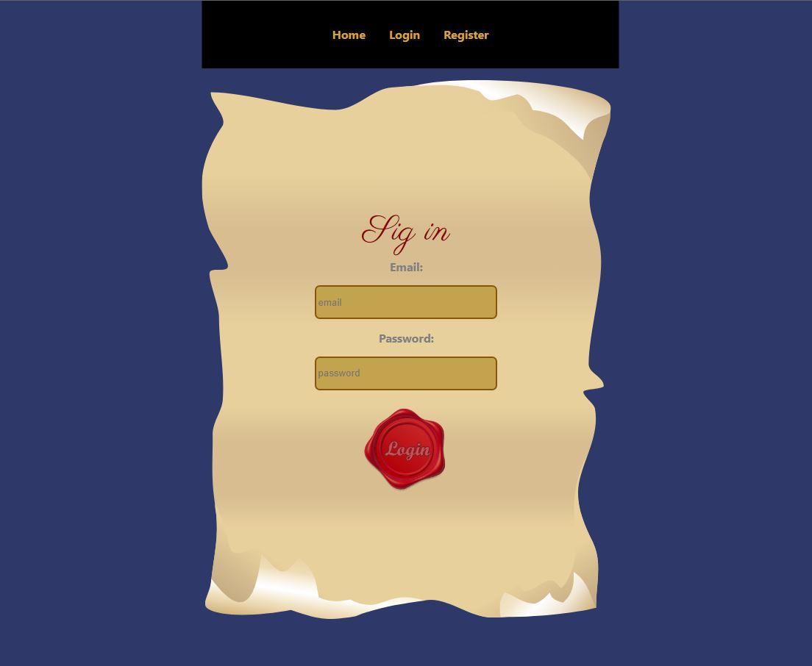
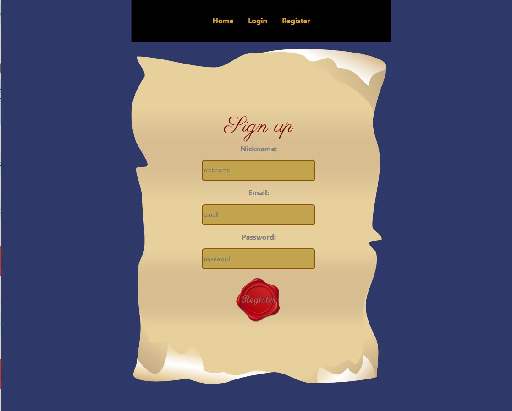
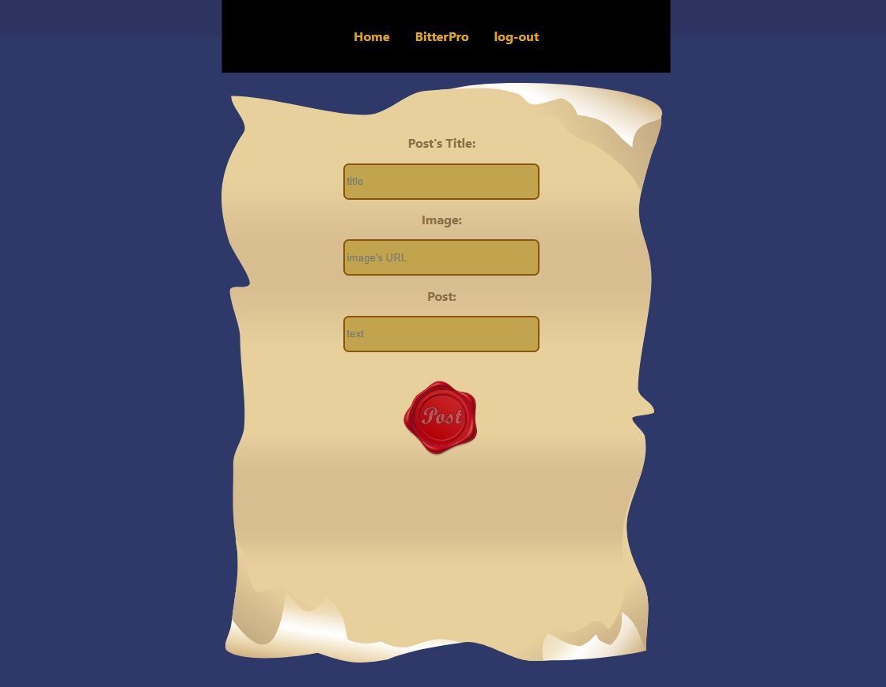
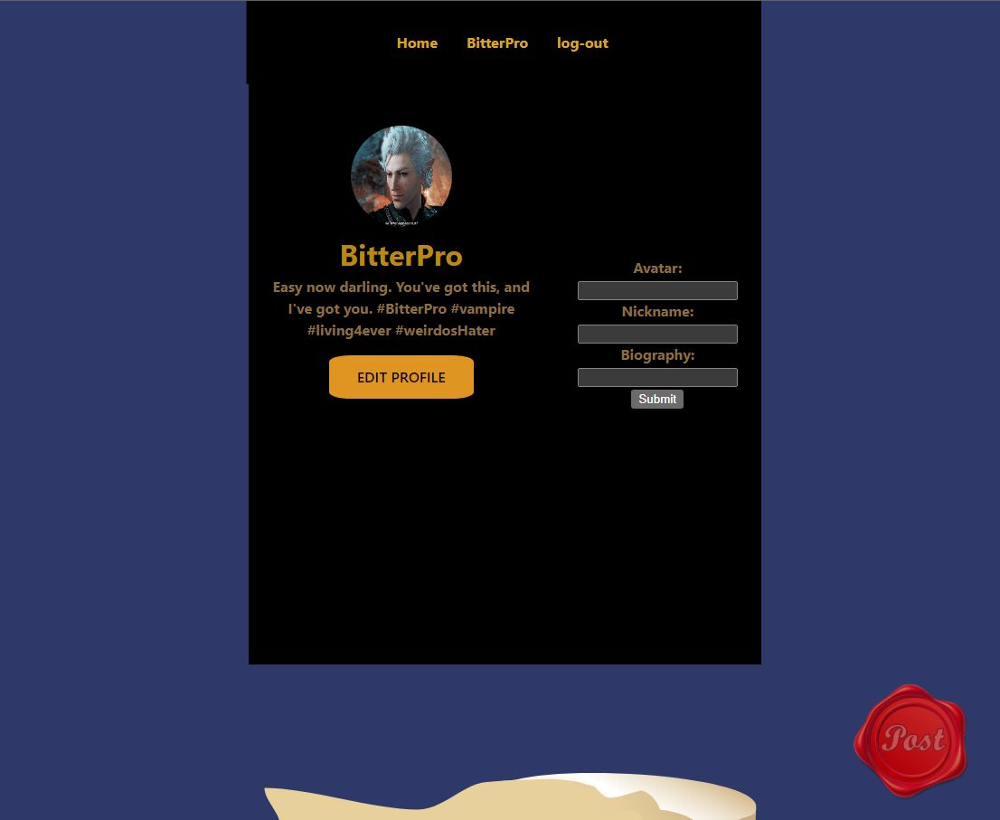
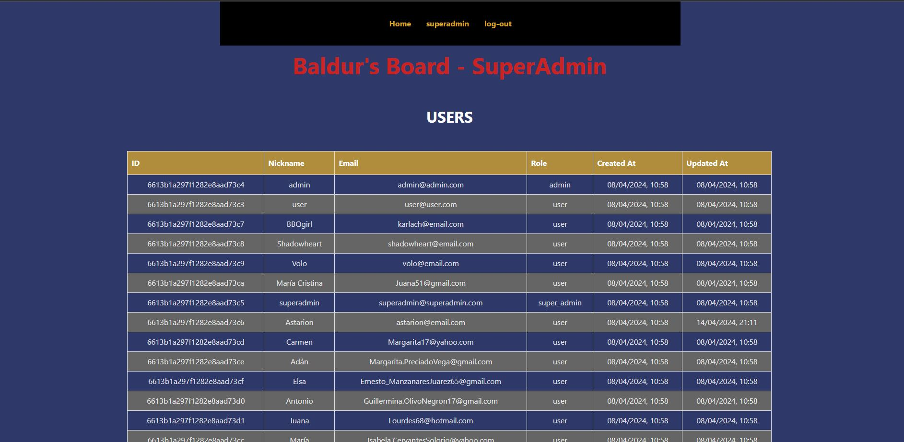

# Ract Frontend: Old Ink
  

Welcome to the Baldur's Board's frontend api documentation. This api recreates a fictional social network website inspired in the game Baldur's Gate. This project is the frontend of [social_network_backend](https://github.com/ariusvi/social_network_backends) project.

---
    

# Contenido 📂
  <ol>
    <li><a href="# About the project 📜">About the project 📜</a></li>
    <li><a href="# Stack ⚓">Stack ⚓</a></li>
    <li><a href="# Local installation 💻">Local installation 💻</a></li>
    <li><a href="# First Design Ideas 💡">First Design Ideas 💡</a></li>
    <li><a href="# Roots 🔗">Roots 🔗</a></li>
    <li><a href="# Bugs 🐜">Bugs 🐜</a></li>
    <li><a href="# Future features ✨">Future features ✨</a></li>
    <li><a href="# Author ✒️">Author ✒️</a></li>
    <li><a href="# Acknowledgements 🙏">Acknowledgements 🙏</a></li>
    </ol>

# About the project 📜
This project is the frontend part of a fictional social network website inspired in the game Baldur's Gate. React has been mainly used. This project connects to a mongo database from project [social_network_backend](https://github.com/ariusvi/social_network_backends).

The Baldur's Board is a frontend project aimed at replicating the user experience of a social media platform akin to Twitter, infused with the aesthetic and themes from the iconic Baldur's Gate video game series. 

Users are provided with functionalities to register, log in, and customize their profiles, including options to set a nickname, upload an avatar, and write a biography. Additionally, users can create and share posts, each consisting of a title, an image (linked via URL), and a description. Furthermore, users can engage with the content by liking posts created by other users.


# Stack ⚓
<div align="center">
<a href="https://www.reactjs.com/">
    
</a>
<a href="https://developer.mozilla.org/es/docs/Web/JavaScript">
    
</a>
</a>
<a href="">
    
</a>
<a href="https://nodejs.org/es/">
    
</a>
<a href="">

</a>
<a href="">
    
</a>
<a href="">
    
</a>
<a href="">
    
</a>
<a href="">
    
</a>
<a href="">
    
</a>
<a href="">
    
</a>
<a href="">
    
</a>
<a href="">
    
</a>
<a href="">
    
</a>
<a href="">
    
</a>
 </div>


# Local installation 💻
 ## Backend
 - Go to: [social_network_backend](https://github.com/ariusvi/social_network_backend)
1. Clone the repository
 ` $ git clone https://github.com/ariusvi/social_network_backend `
2. Install dependencies
 ``` $ npm install --y ``` 
3. Start Express on the server
 ``` $ npm run dev ```
4. Run seeders
 ``` $ npm run seed ``` 

 ## Frontend
1. Clone the repository
 ` $ git clone https://github.com/ariusvi/social_network_frontend `
2. Install dependencies
 ``` $ npm install --y ``` 
3. Start Express on the server
 ``` $ npm run dev ```

 
## Users credentials
- User
```json
nickname: "user",
email: "user@user.com",
password: 123456,
role: "user"
```
- Admin
```json
nickname: "admin",
email: "admin@admin.com",
password: 123456,
role: "admin"
```
- Super_admin
```json
nickname: "superadmin",
email: "superadmin@superadmin.com",
password: 123456,
role: "super_admin"
```

- BitterPro
```json
nickname: "BitterPro",
email: "astarion@email.com",
password: 123456,
role: "user"
```

- BBQgirl
```json
nickname: "BBQgirl",
email: "karlach@email.com",
password: 123456,
role: "user"
```

- Shadowheart
```json
nickname: "Shadowheart",
email: "shadowheart@email.com",
password: 123456,
role: "user"
```

- Volo
```json
nickname: "Volo",
email:"volo@email.com",
password: 123456,
role: "user"
```

# First Design Ideas 💡


  


1. Home  

  


2. Login  

  


3. Register  

  


4. New Post  

  


5. Profile  

  


6. SuperAdmin 

  


# Bugs 🐜
- When user update their profile, they have to log-out and log-in to see the update data.


# Future features ✨
- Change design as first idea design.
- SuperAdmin pannel functional: edit, delete users and posts
- Follow functionality
- See other user's profile
- Searching fields (for admin pannel and at general view for looking for any user by their nickname)
- Data validation

# Author ✒️
* Ana Rius 
    * [GitHub](https://github.com/ariusvi)

# Acknowledgements 🙏
Thanks to my classmates:<br>
[Pedro](https://github.com/Eryhnar) for his patience and help, especially to confirm that I understand things.<br>
[Marina](https://github.com/marinaescriva) and [Marta](https://github.com/MartaGBayona) for her moral support, joint laughter and tears, as well as her help.<br>
